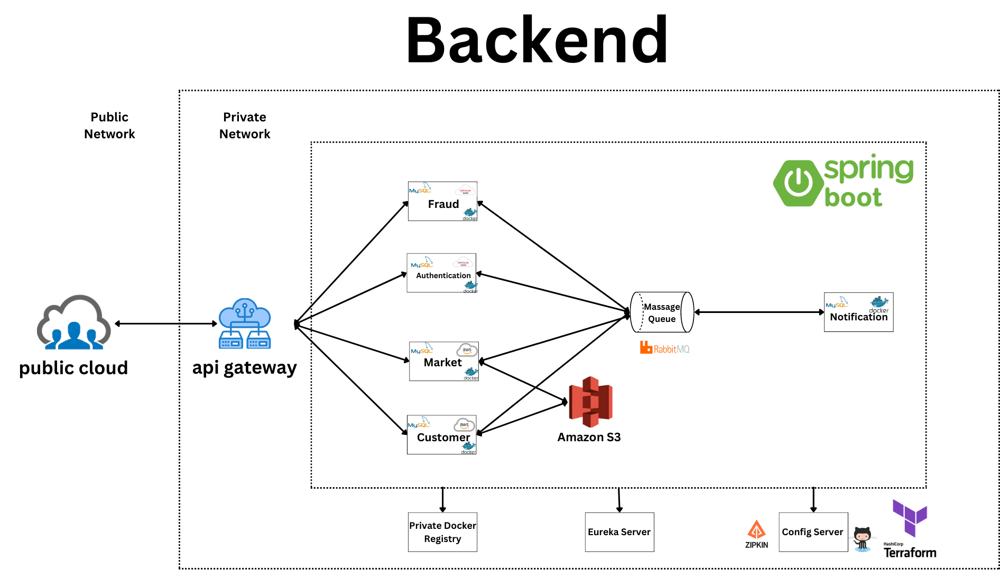

  

# Spring Boot Microservice Architecture Deployment on Oracle and AWS Cloud

## Introduction

This documentation provides an overview of the backend architecture for the application built using Spring Boot, following the microservice architectural pattern. The application is deployed on Oracle and AWS Cloud, utilizing Amazon S3 for file storage. Docker is used for containerization, and Kubernetes is employed for vertical scaling.

## Table of Contents

1. **Architecture Overview**
    - 1.1. Technology Stack
    - 1.2. Microservice Architecture
2. **Cloud Infrastructure**
    - 2.1. Oracle Cloud Deployment
    - 2.2. AWS Cloud Deployment
    - 2.3. Amazon S3 for File Storage
3. **Containerization**
    - 3.1. Docker Setup
    - 3.2. Docker Images
4. **Scalability**
    - 4.1. Kubernetes Setup
    - 4.2. Vertical Scaling

## 1. Architecture Overview

### 1.1. Technology Stack

The backend is built using the following technologies:

- Spring Boot: Provides a robust framework for building microservices.
- Oracle Cloud: Used for hosting and managing various services.
- AWS Cloud: Utilized for additional cloud services and scalability options.
- Amazon S3: Serves as the file storage system for the application.
- Docker: Used for containerization of microservices.
- Kubernetes: Ensures efficient scaling of the application.

### 1.2. Microservice Architecture

The backend architecture follows the microservice pattern, where the application is divided into smaller, independent services, each serving a specific business capability. These microservices can be deployed and scaled independently, providing a flexible and maintainable architecture.

## 2. Cloud Infrastructure

### 2.1. Oracle Cloud Deployment

The application is deployed on Oracle Cloud, leveraging various services such as compute instances, databases, load balancers, and networking components. Oracle Cloud provides a secure and scalable environment for hosting the microservices.

### 2.2. AWS Cloud Deployment

In addition to Oracle Cloud, AWS Cloud is also used to take advantage of specific AWS services that complement the architecture. Certain microservices may be hosted on AWS for better performance and cost optimization.

### 2.3. Amazon S3 for File Storage

Amazon S3 is used as the file storage system for the application. It provides a durable and highly available object storage service, ensuring that files are securely stored and accessible by the microservices.

## 3. Containerization

### 3.1. Docker Setup

Docker is employed to containerize each microservice, enabling consistency across different environments. Containers package the application and its dependencies, ensuring seamless deployment and portability.

### 3.2. Docker Images

Each microservice has its own Docker image, containing all the necessary dependencies and configurations. These images can be deployed independently, facilitating horizontal scaling and quick deployments.

## 4. Scalability

### 4.1. Kubernetes Setup

Kubernetes is used as the orchestration tool to manage the deployment, scaling, and operation of containers. It allows automatic scaling of microservices based on metrics like CPU utilization, ensuring efficient resource utilization.

### 4.2. Vertical Scaling

Kubernetes enables vertical scaling, allowing individual microservices to handle increased load by allocating more resources to them. This ensures that critical services can handle higher traffic without compromising performance.

---

This concludes the documentation for the backend architecture of the application. It covers the technology stack, cloud infrastructure, containerization using Docker, and scalability through Kubernetes. The microservice architecture provides flexibility and scalability, while the combination of Oracle and AWS Clouds ensures a robust and reliable hosting environment.
